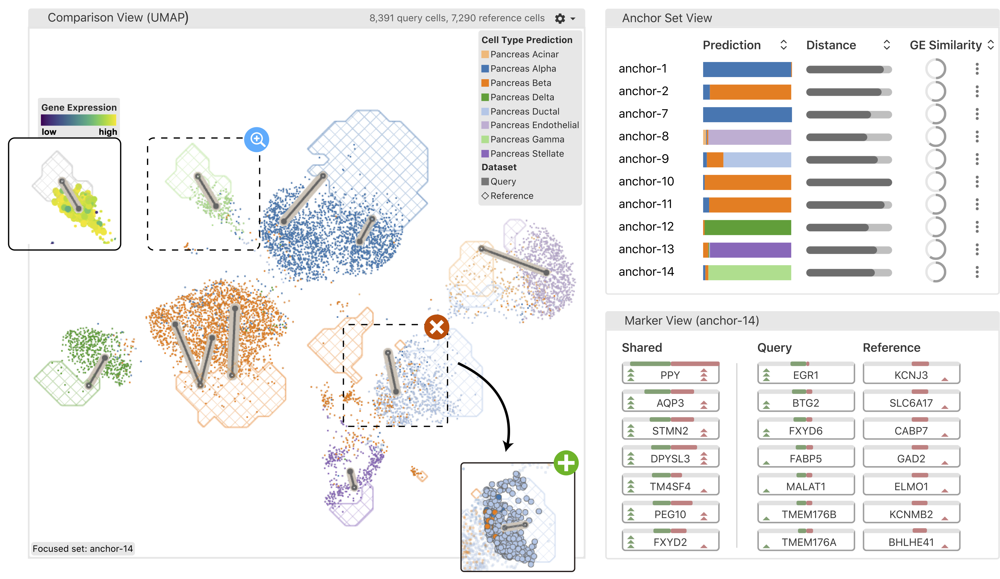

 

# polyphony-vis

[](https://www.npmjs.com/package/vitessce/v/1.1.21)

This repository contains the frontend implementation for [Polyphony](https://github.com/scPolyphony/polyphony), our [interactive transfer-learning framework for reference-based single-cell data analysis](https://osf.io/b76nt/).

__polyphony-vis__ is implemented using the [Vitessce](http://vitessce.io) framework and its [plugin APIs](http://vitessce.io/docs/dev-plugins).

## Run polyphony-vis (frontend)

In this repository, run:

```sh
npm run start
```

Developed under Node v14.0.0 and NPM v6.14.16.

## Run [polyphony](https://github.com/scPolyphony/polyphony) (backend)

In the root of the `polyphony` repository, run:

```sh
polyphony --experiment case-1 --save --load_exist --port 7778
```

Currently works with [`polyphony/069400`](https://github.com/scPolyphony/polyphony/tree/069400a913ea51b864b3d35f4179f999780912f6) (working to adapt to the refactored [`polyphony/main`](https://github.com/scPolyphony/polyphony) in [`polyphony-vis/furui/dataloader-update`](https://github.com/scPolyphony/polyphony-vis/tree/furui/dataloader-update)).

## Documentation

### Plugin file types

#### `anndata-polyphony.zarr`

### Plugin view types

All plugin view types assume there are two `dataset` coordination scopes (named `REFERENCE` and `QUERY`).

#### The comparison view

Registered as `qrComparisonScatterplot`.

#### The anchor set view

Registered as `qrCellSets`.

#### The marker view

Registered as `qrScores`.

#### Status bar

App header view, provides controls for selecting anchor sets and updating the model.
Registered as `qrStatus`.

### Plugin [coordination](http://vitessce.io/docs/coordination/) types

#### `anchorEditTool`

Is the user currently lassoing?

Either `null` or `'lasso'`. By default, `null`.

#### `anchorEditMode`

Which anchor set is the user currently editing?

By default, `null`.

#### `anchorSetFocus`

Which anchor set to focus? (caused by click in the Anchor Set View)

By default, `null`.

#### `anchorSetHighlight`

Which anchor set to highlight? (caused by hover in Anchor Set View)

By default, `null`.

#### `embeddingVisible`

Whether the embedding is visible in the comparison view. Intended to be used to show the reference or query only.

Boolean. By default, `true`.

#### `embeddingEncoding`

How to encode cells on the scatterplot?

Either `'scatterplot'`, `'heatmap'`, `'contour'`, `'scatterplot-and-contour'`. By default, `'scatterplot'`.

#### `embeddingLinksVisible`

Whether the anchor link glyphs between corresponding query and reference sets are visible.

Boolean. By default, `false`.

#### `anchorSetFilter`

How to sort and filter the list of anchor sets in the anchor set view.

By default, `null`.

#### `presetButtonsVisible`

Should the rendering preset buttons be rendered in the comparison view?

Boolean. By default, `true`.

#### `embeddingLegendsVisible`

Should the legends be rendered in the comparison view?

Boolean. By default, `true`.

#### `debugCellTypes`


Boolean. By default, `false`.

#### `embeddingLinksSizeEncoding`

Should the anchor link glyph line width be mapped to the anchor set score?

Either `null` or `'anchorSetScores'`. By default, `'anchorSetScores'`.

#### `cellColorEncodingPlugin`

The same idea as the built-in `cellColorEncoding`, but can take on the value `dataset`.

Either `'dataset'`, `'geneSelection'`, `'cellSetSelection'`. By default, `'cellSetSelection'`.

#### `anchorApiState`

Holds the state (loading, success, error) of requests to the anchor API endpoint.

Object `{ iteration: 1, status: 'success', message: null }`.

#### `modelApiState`

Holds the state (loading, success, error) of requests to the model API endpoint.

Object `{ iteration: 1, status: 'success', message: null }`.

## Citation

To cite Polyphony in your work, please use:

```bibtex
@techreport{cheng2022polyphony,
	title = {Polyphony: an {Interactive} {Transfer} {Learning} {Framework} for {Single}-{Cell} {Data} {Analysis}},
	author = {Cheng, Furui and Keller, Mark S. and Qu, Huamin and Gehlenborg, Nils and Wang, Qianwen},
  institution = {OSF Preprints},
	year = {2022},
  month = apr,
	doi = {10.31219/osf.io/b76nt},
  url = {https://osf.io/b76nt/},
  language = {en}
}
```

## Notes

__polyphony-vis__ was originally implemented as a fork of the Vitessce repository at https://github.com/ChengFR/vitessce/tree/figure-making (see https://github.com/vitessce/vitessce/compare/master...ChengFR:figure-making) before refactoring into the plugin implementation here. Some of the utility functions have been [copied](https://github.com/vitessce/vitessce/issues/1290#issuecomment-1167778916) from Vitessce.